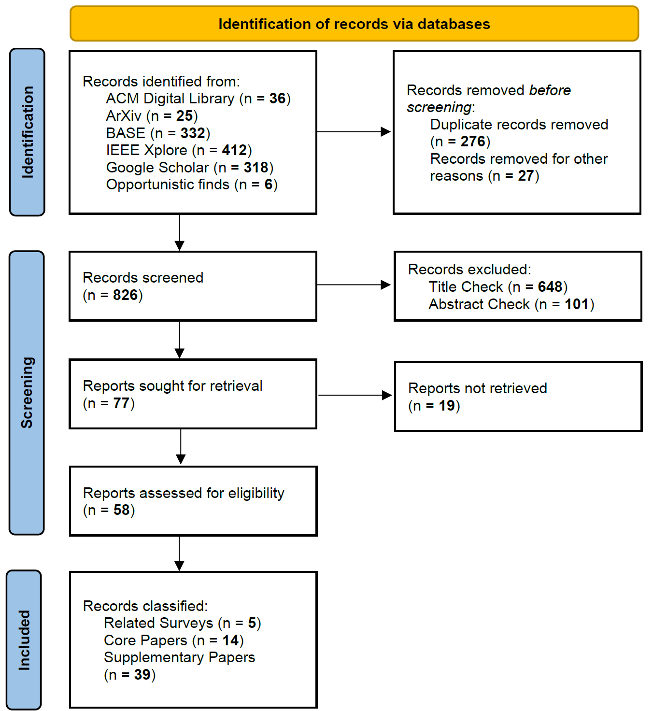
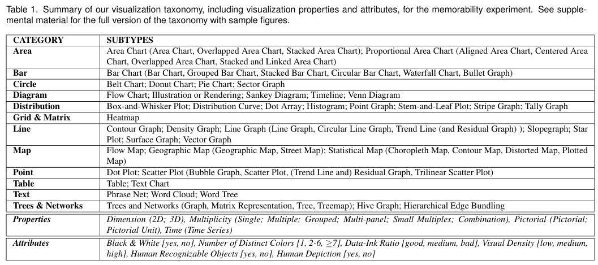

## Content {style="font-size: 80%"}

1.  Introduction
2.  Contribution & Methodology
3.  Principles of Statistical Graphics
4.  Definition of Benchmark Dimensions
5.  Benchmark Characterization Matrix
6.  Gap Analysis
7.  Direction for Future Benchmarks
8.  Limitations
9.  References
10. Appendix

## Introduction {style="font-size: 80%"}

:::{style = "font-size: 90%;"}

-   **Background & Motivation**:
    -   Data visualization is essential for exploratory analysis and communicating results
    -   LLM enables NL2VIS but the generated charts can contain **statistical errors**
-   **Remaining Gap**:
    -   Current benchmark evaluation prioritizes programmatic execution over statistical validity
    -   A chart that renders successfully can still mislead, biasing downstream analysis and distorting interpretation
-   **Research question**:
    -   What are the characteristics of current natural language to visualization (NL2VIS) benchmarks?
-   **Collaboration scenario**:
    -   How can we assess trust in ***LLM-generated visualizations*** via ***statistically principled benchmarks***?

:::

## Contribution {style="font-size: 75%"}
-   A **systematic literature survey** connecting statistical graphics principles and NL2VIS benchmark evaluation criteria
-   A documented taxonomy of **evaluation blind spots** in existing benchmarks
-   A proposed direction for future benchmarks **grounded in statistical validity**

## Methodology (1/2) {style="font-size: 80%"}

-   **6 selected databases** across **2020-2026**
-   **Search query for all databases**:

``` text
("NL2VIS" OR "text-to-vis*" OR "text-to-chart" OR "natural language to vis*" OR "data vis*")
AND ("large language model*" OR "LLM*" OR "multimodal LLM*" OR "MLLM*")
AND ("benchmark*" OR "dataset*" OR "evaluation framework*" OR "evaluat*")
```

-   **Eligibility Criteria**:
    1.  Scope: The paper must present a **standalone benchmark** designed for the **NL2VIS task**, OR introduce an LLM-based visualization system that evaluates its performance using a reproducible evaluation dataset (benchmark)
    2.  Metric Requirement: The paper must explicitly report what **metrics/criteria are used to grade** the generated visualization code or final graphic

## Methodology (2/2) {style="font-size: 80%"}

::: {style="display: flex; justify-content: center; align-items: center; height: 85%;"}
{width="50%" fig-align="center"}
:::

## Principles of Statistical Graphics {style="font-size: 80%"}

**Success of a data visualization depends on following certain graphical principles:**

-   The Hierarchy of Graphical Perception
-   Algebraic Design Principles
-   Structural Integrity through the Grammar of Graphics
-   Direct Representation of Uncertainty and Distributions
-   Prioritising Comparison and Discovery over Aesthetics

## Definition of Benchmark Dimensions (1/2) {style="font-size: 80%"}

**Core dimensions:**

-   Analytical Tasks (13)
-   Chart Types (12)
-   Evaluation Checkpoints
-   Visualization Tradition
-   Visual Intent in Natural Language Queries
-   Ground Truth

## Definition of Benchmark Dimensions (2/2) {style="font-size: 80%"}

:::{style = "font-size: 75%;"}

**Analytical Tasks:** An extended taxonomy, building upon the *Amar and Stasko low-level task taxonomy*, encompassing the analytical operations performed in the process of constructing a visualization:

-   Characterize Distribution, Cluster, Compute Derived Value, Correlate, Determine Range, Filter, Find Anomalies, Find Extremum, Retrieve Value, Sort, *+ Analyse Trend*, *+ Compare*, *+ Forecast*

**Chart Types:** The chart taxonomy of Borkin was taken as a base and extended to capture and consider all the benchmarks

-   Area, Bar, Circle, Diagram, Distribution, Grid & Matrix, Line, Map, Point, Table, Text, Trees & Networks

**Evaluation Checkpoints:**

-   Data Selection Stage, Data Transformation Stage, Visualization Generation Stage, Reading Stage

**Visual Intent in Natural Language Queries:**

-   High Ambiguity, Medium Ambiguity, Low Ambiguity

**Ground Truth:** The reference point of evaluation

:::

## Benchmark Characterization Matrix {style="font-size: 80%"}

```{r}
#| echo: false
#| warning: false
#| message: false

library(DT)

## --- Data (same as benchmark_matrix.R) -----------------------
benchmarks <- data.frame(
  Benchmark = c(
    "VisEval", "nvBench", "NLV Corpus", "nvBench 2.0", "AIDA",
    "Text2Vis", "MatplotAgent", "DV-World", "PMVisBench",
    "DataSciBench", "PlotCraft", "MultiVis-Agent",
    "PandasPlotBench", "NL2SciVis"
  ),
  Year = c(
    2024, 2021, 2021, 2026, 2026,
    2025, 2024, 2026, 2026,
    2025, 2026, 2026,
    2025, 2026
  ),
  stringsAsFactors = FALSE
)

analytical_tasks <- c(
  "Characterize Distribution, Compute Derived Value, Correlate, Determine Range, Filter, Find Extreme, Retrieve Value, Sort",
  "Characterize Distribution, Compute Derived Value, Correlate, Determine Range, Filter, Find Extreme, Retrieve Value, Sort",
  "Characterize Distribution, Compute Derived Value, Correlate, Determine Range, Filter, Find Extreme, Retrieve Value, Sort",
  "Characterize Distribution, Compute Derived Value, Compare, Correlate, Determine Range, Filter, Find Extreme, Retrieve Value, Sort",
  "Analyse Trend, Characterize Distribution, Computed Derived Value, Compare, Correlate, Filter, Find Extreme, Retrieve Value, Sort",
  "Analyse Trend, Characterize Distribution, Compute Derived Value, Compare, Correlate, Find Anomalies, Find Extreme, Forecast, Sort",
  "Analyse Trend, Characterize Distribution, Cluster, Compute Derived Value, Compare, Correlate, No Task",
  "Analyse Trend, Characterize Distribution, Compute Derived Value, Compare, Correlate, Filter, Find Anomalies, Sort",
  "Characterize Distribution, Compute Derived Value, Correlate, Determine Range, Filter, Find Extreme, Retrieve Value, Sort",
  "Analyse Trend, Characterize Distribution, Cluster, Compute Derived Values, Correlate, Find Anomalies, Find Extreme, Forecast",
  "Analyse Trend, Characterize Distribution, Cluster, Composition, Correlate, Forecast, Sort",
  "Analyse Trend, Filter",
  "Analyse Trend, Compute Derived Values, Correlate",
  "Compute Derived Value, Find Extreme"
  )

chart_types <- c(
  "Bar, Circle, Line, Point",
  "Bar, Circle, Line, Point",
  "Bar, Distribution, Line, Point",
  "Bar, Circle, Distribution, Grid & Matrix, Line, Point",
  "Bar, Circle, Distribution, Grid & Matrix, Line, Point",
  "Area, Bar, Circle, Diagram, Distribution, Grid & Matrix, Map, Line, Point, Trees & Networks",
  "Area, Bar, Circle, Diagram, Distribution, Grid & Matrix, Line, Map, Point, Trees & Networks",
  "Area, Bar, Circle, Distribution, Line, Matrix & Grid, Point",
  "Bar, Circle, Line, Point",
  "Bar, Distribution, Grid & Matrix, Line, Point",
  "Area, Bar, Circle, Distribution, Grid & Matrix, Line, Point, Trees & Networks",
  "Area, Bar, Circle, Diagram, Distribution, Grid & Matrix, Line, Point",
  "Area, Bar, Circle, Distribution, Grid & Matrix, Line, Point",
  "N/A (rather 3D visualizations?)"
)

visual_intent <- c(
  "Medium ambiguity",
  "Low, medium and high ambiguity",
  "Low, medium and high ambiguity",
  "Low, medium and high ambiguity",
  "Low, medium ambiguity",
  "Low, medium and high ambiguity",
  "Low ambiguity",
  "Low, medium and high ambiguity",
  "Medium, high ambiguity",
  "Low, medium ambiguity",
  "Low ambiguity",
  "High ambiguity",
  "Low, medium ambiguity",
  "Low ambiguity / highly specialised"
  )

evaluation_checkpoints <- c(
  "Visualization generation stage, reading stage",
  "Reading stage",
  "Visualization generation stage",
  "Reading stage",
  "Visualization generation stage, reading stage",
  "Visualization generation stage, reading stage",
  "Visualization generation stage, reading stage",
  "Visualization generation stage, data selection stage, data transformation stage, reading stage",
  "Data selection stage, data transformation stage, reading stage",
  "Visualization generation stage, reading stage",
  "Visualization generation stage, reading stage",
  "Visualization generation stage",
  "Visualization generation stage, reading stage",
  "Visualization generation stage"
  )

visualization_tradition <- c(
  "Statistical graphics",
  "Statistical graphics",
  "Statistical graphics",
  "Statistical graphics",
  "Statistical graphics",
  "Statistical graphics",
  "Scientific visualization",
  "Information visualization",
  "Statistical graphics",
  "Statistical graphics",
  "Statistical graphics (per appendix)",
  "Statistical graphics",
  "Statistical graphics",
  "Scientific visualization"
)

ground_truth <- c(
  # VisEval
  paste(
    "Chart type, plotted data, and meta-information",
    "(specified channels, sorting requirements, and whether",
    "the bar chart is stacked)"
  ),

  # nvBench
  paste(
    "VIS queries stored as ASTs specifying chart type,",
    "selected attributes, grouping/binning, aggregation function,",
    "filter conditions, and ordering"
  ),

  # NLV Corpus
  "Pre-existing charts",

  # nvBench 2.0
  paste(
    "Data table, ambiguous query, a set of valid visualizations",
    "derived from the query, and step-wise reasoning paths showing",
    "how the ambiguity was resolved for each visualization-query pair"
  ),

  # AIDA
  paste(
    "Tasks independently labeled and cross-reviewed by at least",
    "two additional experts"
  ),

  # Text2Vis
  "Short textual answer and visualization code",

  # MatplotAgent
  "Visualization",

  # DV-World
  "Visualization",

  # PMVisBench
  "Visualization Query Language (VQL)",

  # DataSciBench
  "Visualization",

  # PlotCraft
  "Human-generated Python code snippets that compile into the desired charts",

  # MultiVis-Agent
  "Scenario-dependent ground truth, generally annotated by human experts",

  # PandasPlotBench
  "Ground-truth plot and code",

  # NL2SciVis
  "Human-generated Python code"
)

benchmarks$`Analytical Tasks`               <- analytical_tasks
benchmarks$`Chart Types`                     <- chart_types
benchmarks$`Visual Intent in the NL Queries` <- visual_intent
benchmarks$`Evaluation Checkpoints`          <- evaluation_checkpoints
benchmarks$`Visualization Tradition`         <- visualization_tradition
benchmarks$`Ground Truth` <- ground_truth

final_cols <- c(
  "Benchmark",
  "Analytical Tasks",
  "Chart Types",
  "Visual Intent in the NL Queries",
  "Evaluation Checkpoints",
  "Visualization Tradition",
  "Ground Truth"
)
df <- benchmarks[, final_cols]

## --- Interactive table sized to fit inside a reveal.js slide ---
datatable(
  df,
  rownames = FALSE,
  filter = "top",
  extensions = "FixedHeader",
  options = list(
     dom = "frtip",
     scrollY = "420px",     
     scrollCollapse = TRUE,
     paging = FALSE,
     fixedHeader = TRUE,
     autoWidth = FALSE,
     columnDefs = list(
  list(width = "100px", targets = 0),
  list(width = "190px", targets = c(1, 3, 4, 6)),
  list(width = "150px", targets = c(2, 5))
)
   ),
  class = "stripe hover compact"
) |>
  formatStyle(
    columns = final_cols,
    `white-space` = "normal",
    `vertical-align` = "top"
  ) |>
  htmlwidgets::prependContent(
    htmltools::tags$style(
      htmltools::HTML("
        /* 整个 DT 表格的默认字号 */
        div.dataTables_wrapper {
          font-size: 13px !important;
        }

        /* 表头 */
        table.dataTable thead th {
          font-size: 13px !important;
          font-weight: 600 !important;
          line-height: 1.1 !important;
          padding: 4px 6px !important;
        }

        /* 正文单元格 */
        table.dataTable tbody td {
          font-size: 14px !important;
          line-height: 1.2 !important;
          padding: 5px 6px !important;
          vertical-align: top !important;
        }

        /* 每列上方的筛选框 */
        table.dataTable thead input {
          font-size: 11px !important;
          height: 18px !important;
          padding: 1px 3px !important;
        }

        /* 右上角 Search */
        div.dataTables_filter,
        div.dataTables_filter input {
          font-size: 11px !important;
        }

        div.dataTables_filter input {
          height: 20px !important;
        }

        /* 底部 Showing 1 to ... */
        div.dataTables_info {
          font-size: 12px !important;
        }
      ")
    )
  )
```

## Gap Analysis: Insights from the Matrix (1/2) {style="font-size: 80%"}

-   Inclusion of more complex statistical tasks
    -   *Low level task taxonomy is insufficient*
-   Match between ambiguity levels and evaluation depth
    -   *Lower ambiguity queries result in more precise visualizations*
-   Consideration of perceptual encoding hierarchy
    -   *Position \> Length \> Angle \> Color*
    -   *e.g. Implication of Bar Chart Principle*
-   Type-conditioned evaluation for different visual traditions
    -   *Different visual traditions = Different visualization intents + rules*

## Gap Analysis: Additional Insights (2/2) {style="font-size: 80%"}

:::{style = "font-size:90%;"}

-   Statistical validity of the ground truth
-   Appropriateness checks for the visual encoding
    -   *Ensuring the harmony of the visual elements task-wise*
-   Data-Ink Ratio
    -   *Eliminating purposeless design elements to highlight main message*
-   Representation of uncertainty with fitting methods
-   Consideration of visualization pitfalls and mirages in the evaluation framework
    -   *Verification of query-conformance, but none for data change conformance*
-   Usage of GoG conformant languages
    -   *e.g. ggplot2 is found to be conformant to GoG*
-   Accessibility Checks
    -   *Different properties of colors to account for (e.g. Hue & luminance)*

:::

## Direction for Future Benchmarks {style="font-size: 80%"}

::::::: {style="display: grid; grid-template-columns: 0.5fr 1fr 1fr 1fr; gap: 10px; height: 100%; overflow-y: auto; font-size: 75%;"}
::: {}

**Dataset**

-   All ambiguity levels
-   More complex analytical tasks

:::
<div>

**Legality Checks**

Query-chart compliance

-   Chart type, data, order, + task type
-   Predictive nature requires uncertainty representation
-   Check if underlying distribution warrants aggregation
-   Check appropriateness of chart type via measurement scale of variables

</div>

<div>

**Validity Checks**

Successful execution of code in a sandboxed environment

-   Checks for syntactical correctness
-   Correct referencing and availability of data sources, required libraries, APIs, and variables
-   Check of rendering output
-   Consistency among repeated executions under the same environment conditions

</div>

<div>

**Readability Checks**

Clear presentation of information

-   Layout check for placement of elements
-   Appropriateness check for scaling and reference points along correct units
-   Respecting Data-Ink Ratio & No Chartjunk
-   Ensuring title informativeness through low ambiguity recommendations
-   Accessibility checks (font, colors etc.)
-   Perceptual encoding hierarchy

</div>
:::::::

## Limitations {style="font-size: 80%"}

-   Only targeted search for literature on statistical graphics
-   Despite systematic search for NL2VIS literature, some benchmarks might not have been found
-   Manual classification of queries into a uniform analytical task taxonomy made benchmarks comparable, but required subjective judgement

## References for Statistical Graphics {style="font-size: 80%"}

::: {style="font-size: 60%"}
-   Bresciani, S., & Eppler, M. J. (2015). The pitfalls of visual representations. SAGE Open, 5(4). https://doi.org/10.1177/2158244015611451
-   Cleveland, W. S., & McGill, R. (1984). Graphical perception: Theory, experimentation, and application to the development of graphical methods. Journal of the American Statistical Association, 79(387), 531–554. https://doi.org/10.2307/2288400
-   Gelman, A., & Unwin, A. (2013). Infovis and statistical graphics: Different goals, different looks. Journal of Computational and Graphical Statistics, 22(1), 2–28. https://doi.org/10.1080/10618600.2012.761137
-   Heer, J., & Bostock, M. (2010). Crowdsourcing graphical perception: Using Mechanical Turk to assess visualization design. Proceedings of the SIGCHI Conference on Human Factors in Computing Systems (CHI '10), 203–212. https://doi.org/10.1145/1753326.1753357
-   Hullman, J., & Gelman, A. (2021). Designing for interactive exploratory data analysis requires theories of graphical inference. Harvard Data Science Review. https://doi.org/10.1162/99608f92.3ab8a587
-   Kay, M. (2023). ggdist: Visualizations of Distributions and Uncertainty in Grammar of Graphics. IEEE Transactions on Visualization and Computer Graphics, 30(1), 1–11. https://doi.org/10.1109/tvcg.2023.3327195
-   Kindlmann, G., & Scheidegger, C. (2014). An algebraic process for visualization design. IEEE Transactions on Visualization and Computer Graphics, 20(12), 2181–2190. https://doi.org/10.1109/TVCG.2014.2346325
-   McNutt, A., Kindlmann, G., & Correll, M. (2020). Surfacing visualization mirages. Proceedings of the 2020 CHI Conference on Human Factors in Computing Systems (CHI '20), 1–16. https://doi.org/10.1145/3313831.3376420
-   Wickham, H. (2009). A layered grammar of graphics. Journal of Computational and Graphical Statistics, 19(1), 3–28. https://doi.org/10.1198/jcgs.2009.07098
-   Wilkinson, L. (2010). The grammar of graphics. WIREs Computational Statistics, 2(6), 673–677. https://doi.org/10.1002/wics.118
:::

## References for Benchmark Papers (1/2) {style="font-size: 80%"}

::: {style="font-size: 60%"}
-   Chen, N., Zhang, Y., Xu, J., Ren, K., & Yang, Y. (2024). VisEval: A benchmark for data visualization in the era of large language models. IEEE Transactions on Visualization and Computer Graphics, 31(1), 1301–1311. https://doi.org/10.1109/TVCG.2024.3456320
-   Galimzyanov, T., Titov, S., Golubev, Y., & Bogomolov, E. (2025). Drawing Pandas: A benchmark for LLMs in generating plotting code. Proceedings of the 2025 IEEE/ACM 22nd International Conference on Mining Software Repositories (MSR), 503–507. https://doi.org/10.1109/MSR66628.2025.00083
-   Lu, J., Song, Y., Zhang, C., & Wong, R. C.-W. (2026). MultiVis-Agent: A multi-agent framework with logic rules for reliable and comprehensive cross-modal data visualization. Proceedings of the ACM on Management of Data, 4(1), Article 56, 25 pages. https://doi.org/10.1145/3786670
-   Luo, T., Huang, C., Shen, L., Li, B., Shen, S., Zeng, W., Tang, N., & Luo, Y. (2025). nvBench 2.0: A benchmark for natural language to visualization under ambiguity (arXiv:2503.12880). arXiv. https://doi.org/10.48550/arXiv.2503.12880
-   Luo, Y., Tang, N., Li, G., Chai, C., Li, W., & Qin, X. (2021). Synthesizing natural language to visualization (NL2VIS) benchmarks from NL2SQL benchmarks. Proceedings of the 2021 International Conference on Management of Data (SIGMOD '21), 1235–1247. https://doi.org/10.1145/3448016.3457261
-   Mathai, M., Han, M., Knowles, J., Mateevitsi, V. A., Rizzi, S., & Childs, H. (2026). NL2SciVis: A benchmark for natural language to scientific visualization. In J. Byska, A. Ottley, & M. Waldner (Eds.), EuroVis 2026 – Short Papers. The Eurographics Association. https://doi.org/10.2312/evs.20261017
-   Meng, J., Huang, S., Lei, F., Guo, J., Liu, H., Su, J., Wang, S., Wang, Y., Wang, E., Yang, Y., Chai, H., Lv, J., Yu, A., Zhang, H., Zhang, Y., Huang, Y., Ma, Z., He, S., Zhao, J., & Liu, K. (2026). DV-World: Benchmarking data visualization agents in real-world scenarios (arXiv:2604.25914). arXiv. https://doi.org/10.48550/arXiv.2604.25914
:::

## References for Benchmark Papers (2/2) {style="font-size: 80%"}

::: {style="font-size: 60%"}
-   Rahman, M., Laskar, M. T. R., Joty, S., & Hoque, E. (2025). Text2Vis: A challenging and diverse benchmark for generating multimodal visualizations from text (arXiv:2507.19969). arXiv. https://doi.org/10.48550/arXiv.2507.19969
-   Srinivasan, A., Nyapathy, N., Lee, B., Drucker, S. M., & Stasko, J. (2021). Collecting and characterizing natural language utterances for specifying data visualizations. Proceedings of the 2021 CHI Conference on Human Factors in Computing Systems (CHI '21), Article 464, 1–10. https://doi.org/10.1145/3411764.3445400
-   Xu, W., Zhang, C. J., Wei, X., Li, H., Kim, H., Song, Y., & Wong, R. C.-W. (2026). Towards reliable agentic progressive text-to-visualization with verification rules (arXiv:2605.29692). arXiv. https://doi.org/10.48550/arXiv.2605.29692
-   Yang, Y., Lei, F., Sun, Y., Zeng, Y., Lv, C., Hong, J., Tian, J., Qiu, T., Wang, X., Chen, Y., Li, Y., Pan, Z., Zhou, X., Chen, G., Lv, H., Xu, Y., Ou, Y., Liu, H., He, S., ... Sun, W. (2026). AIDABench: AI data analytics benchmark (arXiv:2603.15636). arXiv. https://doi.org/10.48550/arXiv.2603.15636
-   Yang, Z., Zhou, Z., Wang, S., Cong, X., Han, X., Yan, Y., Liu, Z., Tan, Z., Liu, P., Yu, D., Liu, Z., Shi, X., & Sun, M. (2024). MatPlotAgent: Method and evaluation for LLM-based agentic scientific data visualization (arXiv:2402.11453). arXiv. https://doi.org/10.48550/arXiv.2402.11453
-   Zhang, D., Zhoubian, S., Cai, M., Li, F., Yang, L., Wang, W., Dong, T., Hu, Z., Tang, J., & Yue, Y. (2025). DataSciBench: An LLM agent benchmark for data science (arXiv:2502.13897). arXiv. https://doi.org/10.48550/arXiv.2502.13897
-   Zhang, J., Zhang, J., Cui, Z., Yang, J., Zhang, L., Hui, B., Liu, Q., Wang, Z., Wang, L., & Lin, J. (2026). PlotCraft: Pushing the limits of LLMs for complex and interactive data visualization (arXiv:2511.00010). arXiv. https://doi.org/10.48550/arXiv.2511.00010
:::

## Other References for Taxonomies and Supplementary Material {style="font-size: 80%"}

-   Amar, R. A., Eagan, J. R., & Stasko, J. T. (2005). Low-level components of analytic activity in information visualization. In Proceedings of the IEEE Symposium on Information Visualization (InfoVis 2005) (pp. 111–117). IEEE. https://doi.org/10.1109/INFVIS.2005.1532136
-   Borkin, M. A., Vo, A. A., Bylinskii, Z., Isola, P., Sunkavalli, S., Oliva, A., & Pfister, H. (2013). What makes a visualization memorable? IEEE Transactions on Visualization and Computer Graphics, 19(12), 2306–2315. https://doi.org/10.1109/TVCG.2013.234
-   Tory, M., & Möller, T. (2004). Rethinking visualization: A high-level taxonomy. In Proceedings of the IEEE Symposium on Information Visualization (InfoVis 2004) (pp. 151–158). IEEE. https://doi.org/10.1109/INFVIS.2004.59

## Appendix {style="font-size: 80%"}

**Content:**

I.  Analytical Tasks
II. Chart Types
III. Visual Intent in the Natural Language Queries
IV. Evaluation Checkpoints
V.  Visualization Tradition

## Appendix I: Analytical Tasks {style="font-size: 80%"}

::: {style="font-size: 60%"}
**Extended Amar and Stasko Low Level Analytical Task Taxonomy**

**Characterize Distribution:** Given a set of data observations and a quantitative attribute of interest, characterize the distribution of that attribute’s values over the set

**Cluster:** Given a set of data observations, find clusters of similar attribute values

**Compute Derived Value:** Given a set of data observations, compute an aggregate numeric representation of those data observations

**Correlate:** Given a set of data observations and two attributes, determine useful relationships between the values of those attributes

**Determine Range:** Given a set of data observations and an attribute of interest, find the span of values within the set

**Filter:** Given some concrete conditions on attribute values, find observations satisfying those conditions

**Find Anomalies:** Identify any anomalies within a given set of data observations with respect to a given relationship or expectation, e.g. statistical outliers

**Find Extremum:** Find observations possessing an extreme value of an attribute over its range within the data set

**Retrieve Value:** Given a set of specific observations in the dataset, find attributes of those observations

**Sort:** Given a set of data observations, rank them according to some ordinal metric

**(+) Analyse Trend:** Given a set of data observations ordered along a temporal attribute, characterize the patterns of changes, exhibited by these observations

**(+) Compare:** Given two or more sets of observations, determine how they differ with respect to an attribute or a derived value

**(+) Forecast:** Given historical observations of an attribute ordered over time, extrapolate or predict its values beyond the range of observed data
:::

## Appendix II: Chart Types {style="font-size: 80%"}

**Borkin Visualization Taxonomy**

::: {style="display: flex; justify-content: center; align-items: center; height: 80%;"}
{fig-align="center"}
:::

## Appendix III: Visual Intent in the NL Queries {style="font-size: 80%"}

**Examples taken from NLVCorpus**

**High Ambiguity:** The prompt specifies only the analytical task, leaving the chart type and other specifications unspecified

-   *"Show me count of movies categorized by creative type"*

**Medium Ambiguity:** The prompt specifies the analytical task and chart type, while leaving visualization details(e.g. encodings, layout, styling) unspecified

-   *"Line chart average weight over year"*

**Low Ambiguity:** The prompt specifies the analytical task, chart type and most visualization specifications

-   *"Please show me the average accelerations of cars in multiple bar charts aggregated by the number of cylinders. In each bar chart, different bars represent different origins."*

## Appendix IV: Evaluation Checkpoints {style="font-size: 80%"}

**Data Selection Stage:** Verifies that the observations required for the analysis have been correctly identified and extracted from the dataset(s)

**Data Transformation Stage:** Verifies that the data has been appropriately wrangled and prepared for visualization

**Visualization Generation Stage:** Verifies that the visualization was successfully produced, either through execution of the rendering code or through the LLM's successful generation of the visualization

**Reading Stage:** Verifies that the resulting visualization aligns with the established evaluation criteria and ground truth

## Appendix V: Visualization Tradition {style="font-size: 80%"}

**InfoVis:** Ideally should be attractive, grab one’s attention, tell a story, and encourage the viewer to think about a particular dataset, both as individual measurements and as a representation of larger patterns

**Statistical Graphics:** Focused not on visual appeal but on facilitating an understanding of patterns in an applied problem, both in directing readers to specific information and allowing the readers to see for themselves

**Scientific Graphs:** Scientific visualization: traditionally refers to visualizing data that is scientific in application, physically based, and has a given spatialization (i.e., the data's spatial arrangement is inherent, like 3D medical images or wind tunnel vector data)
